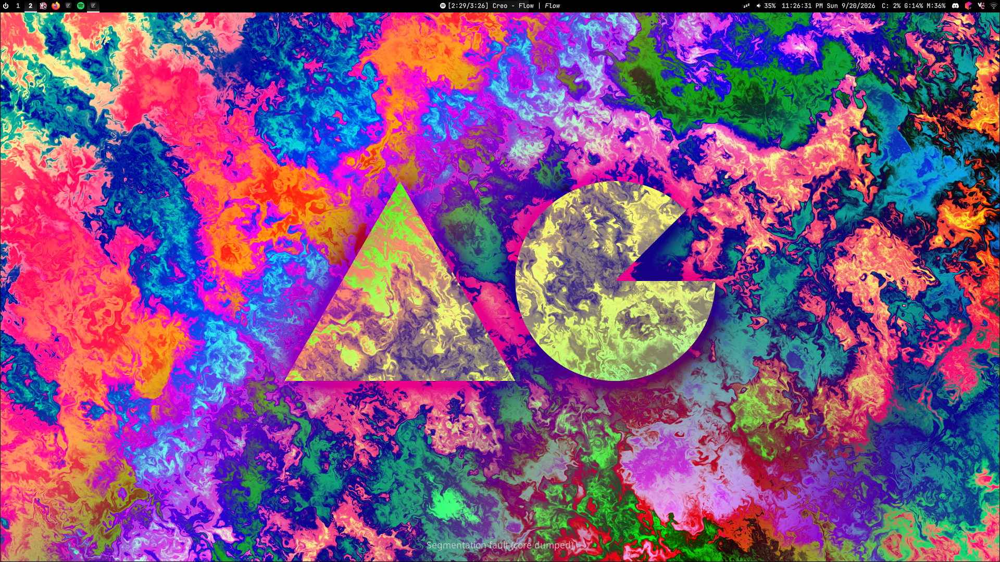

# About
A personal Quickshell configuration made for Hyprland on Fedora

# Notable Features
- SpotifyButton (left-click to toggle playback, drag right-click to change song position)
- DiscordButton (tracks how many pings you have)
- SystemMonitorButton (tracks CPU, GPU, and RAM usage)

# Dependencies
- Recourses Flatpak (for SystemMonitorButton onClicked)
- GNOME Calendar Flatpak (for CalendarButton onClicked)
- Vesktop (for DiscordButton functionality)
- JetBrainsMono Nerd Font (for fontFamily)
